# EventsData 2017-2025: Comprehensive Data Analysis Report

---

## 1. Overall Data Understanding

### Source File Structure
The Excel workbook `EventsData_2017_2025.xlsx` contains **4 sheets**:

| Sheet | Purpose | Rows | Cols |
|-------|---------|------|------|
| **Data** | Main event-member dataset | 78,124 records | 40 columns |
| **GP 2025** | Gurupurnima 2025 hotel room reservations by date | ~30 rows | 14 cols |
| **GP 2025 Hotel Pickup** | Hotel pickup notes (sparse) | Minimal | - |
| **Pivot Table 1** | Empty pivot table shell | - | - |

### Key Metrics at a Glance

| Metric | Value |
|--------|-------|
| Total Data Rows | 78,124 (64,222 valid + 13,902 null tail) |
| Unique Events | **118** |
| Unique Members (MemberID) | **23,206** |
| Unique Families (FamilyID) | **10,967** |
| Gurupurnima (GP) Events | **14** (flagged via `IsGPEvent`) |
| Year Span | 2017 - 2025 (9 years) |
| Countries Represented | **10+** (US, Canada, India, UK, Germany, UAE, Brazil, Australia, Singapore, Kenya) |

---

## 2. Column Inventory (40 Columns)

### Core Entity Columns (Common Across All Years)

These columns appear in every row and form the backbone of the dataset:

| # | Column | Type | Description | Null % |
|---|--------|------|-------------|--------|
| 1 | `EventName` | VARCHAR | Full event name with year | 17.8%* |
| 2 | `EventStartDate` | TIMESTAMP | Event start datetime | 18.4%* |
| 3 | `EventEndDate` | TIMESTAMP | Event end datetime | 18.4%* |
| 4 | `IsGPEvent` | BOOLEAN/FLOAT | 1.0 = Gurupurnima event | 17.8%* |
| 5 | `MahatmaID` | INTEGER | Unique spiritual ID | 59.9% |
| 6 | `FirstName` | VARCHAR | Member first name | 17.8%* |
| 7 | `MiddleName` | VARCHAR | Member middle name | 57.7% |
| 8 | `LastName` | VARCHAR | Member last name | 17.8%* |
| 9 | `Gender` | VARCHAR/FLOAT | M/F (2017-2024) or 1.0/2.0 (2024-2025) | 17.8%* |
| 10 | `AgeNow` | INTEGER | Current age at export | 17.8%* |
| 11 | `AgeAtEvent` | INTEGER | Age at time of event | 17.8%* |
| 12 | `GnanDate` | DATE | Date of Gnan ceremony | 45.1% |
| 13 | `HasGnanTakenInThisEvent` | BOOLEAN | 1 = received Gnan at this event | 17.8%* |
| 14 | `MemberID` | INTEGER | System member identifier | 17.8%* |
| 15 | `FamilyID` | INTEGER | Family group identifier | 17.8%* |
| 16 | `HasMemberRegisteredForEvent` | BOOLEAN | Registration flag | 17.8%* |
| 17 | `HasMemberCheckedInForEvent` | BOOLEAN | Check-in flag | 17.8%* |
| 18 | `EventCheckedInTimeUTC` | TIMESTAMP | UTC check-in timestamp | 55.5% |
| 19 | `HasRoomBookedByFamily` | BOOLEAN | Room booking flag | 17.8%* |
| 20 | `OccupantsInRoom` | INTEGER | Number of occupants | 17.8%* |
| 21 | `RoomsPerFamily` | INTEGER | Rooms booked per family | 17.8%* |
| 22 | `HasMemberStayedInRoom` | BOOLEAN | Actual room stay flag | 17.8%* |
| 23 | `AssumedRoomCheckInDate` | DATE | Room check-in date | 83.9% |
| 24 | `AssumedRoomCheckOutDate` | DATE | Room check-out date | 83.9% |
| 25 | `RoomType` | VARCHAR | Room type description | 78.8% |
| 26 | `HotelName` | VARCHAR | Hotel name | 73.4% |
| 27 | `Phone1` | VARCHAR/FLOAT | Primary phone | 30.5% |
| 28 | `Phone2` | VARCHAR/FLOAT | Secondary phone | 81.0% |
| 29 | `EmailAddress` | VARCHAR | Email | 35.1% |
| 30 | `BirthMonth` | INTEGER | Birth month (1-12) | 17.8%* |
| 31 | `BirthYear` | INTEGER | Birth year | 17.8%* |
| 32 | `PhotoFileName` | VARCHAR | Photo file reference | 71.3% |
| 33 | `Address1` | VARCHAR | Street address line 1 | 17.8%* |
| 34 | `Address2` | VARCHAR | Street address line 2 | 87.2% |
| 35 | `City` | VARCHAR | City | 17.8% |
| 36 | `State` | VARCHAR | State/Province | 17.9% |
| 37 | `Zipcode` | VARCHAR/FLOAT | Postal code | 17.8% |
| 38 | `Country` | VARCHAR | Country | 17.8%* |
| 39 | `EventID` | INTEGER | System event identifier | 17.8%* |
| 40 | `InMMS` | BOOLEAN | In MMS system flag | 17.8%* |

> *\*17.8% null = the 13,902 completely null trailing rows*

---

## 3. Event Classification & Auxiliary Data Design

### 3.1 Event Type Taxonomy

Events naturally cluster into **9 categories**:

| Event Type | Count | Description |
|------------|-------|-------------|
| **Gurupurnima** | 13 | Annual flagship event (largest attendance) |
| **Satsang** | 42 | Regional spiritual gatherings, often with Gnanvidhi |
| **Retreat** | 20 | Multi-day retreats (regional, MHT-specific) |
| **Youth Camp** | 16 | Boys/Girls summer/winter camps |
| **Shibir** | 10 | Intensive workshops/seminars |
| **Learning** | 5 | Gujarati language classes |
| **Cruise** | 1 | Akram Cruise 2025 |
| **Virtual** | ~5 | COVID-era virtual events (2020-2021) |
| **Other** | 11 | Miscellaneous (Darshan, Jatra, Dinner, etc.) |

### 3.2 Regional Zone Mapping (Extracted from Event Names)

| Zone | States Covered |
|------|---------------|
| North East | NJ, NY, PA, MA, CT |
| South East | NC, GA, FL, SC, VA |
| South Central | TX, OK |
| North Central | IL, IA, MN |
| West Coast | CA, AZ, NV |
| Canada | ON (Toronto), QC (Montreal), Ottawa |

### 3.3 Auxiliary Data Tables Identified

**AUX 1: Event Metadata**
- Event type classification (Gurupurnima, Satsang, Retreat, etc.)
- Zone/Region
- Is virtual (boolean)
- Has Gnanvidhi (boolean)
- Demographic target (Youth, WMHT, DMHT, MMHT, YMHT, Y+, General)

**AUX 2: Hotel Inventory (from GP 2025 sheet)**
- Hotel name, room types, daily capacity
- Date-level room allocation (for GP events)

**AUX 3: Room Type Normalization**
- 65+ raw room type variants -> ~8 canonical types
- Mapping: "Two Queen Beds", "2 Queen Beds", "2 beds" -> "Double Queen"

**AUX 4: Gender Code Normalization**
- 2017-2024: M/F string encoding
- 2024-2025: 1=Male, 2=Female numeric encoding

---

## 4. Relational Mapping

### 4.1 Entity-Relationship Model

```
MEMBER (1) ----< (M) EVENT_ATTENDANCE >---- (1) EVENT
   |                      |
   |                      |---- ROOM_BOOKING (0..1)
   |
   +---- FAMILY (M:1)
   |
   +---- GNAN_RECORD (0..1 per event)
   |
   +---- ADDRESS (1:1, slowly changing)
```

### 4.2 Key Relationships

| Relationship | Cardinality | Join Key |
|-------------|-------------|----------|
| Member -> Family | Many-to-One | `FamilyID` |
| Member -> Event Attendance | One-to-Many | `MemberID` + `EventID` |
| Event Attendance -> Room Booking | One-to-Zero/One | `MemberID` + `EventID` |
| Event -> Hotel Allocation | One-to-Many | `EventID` |
| Member -> Gnan Record | One-to-One | `MahatmaID` / `GnanDate` |

---

## 5. Data Discrepancy & Missing Data Analysis

### 5.1 Null Row Block (CRITICAL)
- **13,902 completely null rows** at the tail (rows 64,224 - 78,125)
- These appear to be empty padding rows from the Excel export
- **Action**: Drop entirely during ETL

### 5.2 Year-Level Data Completeness Heatmap

```
Column                    2017  2018  2019  2020  2021  2022  2023  2024  2025
─────────────────────────────────────────────────────────────────────────────────
MahatmaID                 59%   59%   52%   47%   46%   58%   63%   62%   18%
GnanDate                  33%   34%   31%   34%   31%   38%   40%   39%   20%
Phone1                    16%   15%   14%   14%   14%   16%   19%   17%   12%
EmailAddress              26%   24%   22%   19%   16%   21%   24%   22%   14%
EventCheckedInTimeUTC     43%   45%   49%  100%  100%   35%   36%   33%   45%
HotelName                 64%   64%   67%   45%  100%   69%   68%   74%   62%
RoomType                  64%  100%   67%  100%  100%   69%   68%   74%   62%
MiddleName                53%   52%   47%   38%   40%   53%   59%   57%   29%
PhotoFileName             58%   58%   52%   46%   45%   58%   62%   64%  100%
─────────────────────────────────────────────────────────────────────────────────
```
*(Values = % null. Red threshold: >80%)*

### 5.3 Key Discrepancies Identified

| # | Issue | Severity | Details | Imputation Strategy |
|---|-------|----------|---------|-------------------|
| 1 | **Gender encoding inconsistency** | HIGH | 2017-2024 uses `M`/`F` strings; 2025 events use `1`/`2` floats | Map `1->M`, `2->F` during ETL |
| 2 | **Null trailing rows** | HIGH | 13,902 completely empty rows | Drop during import |
| 3 | **RoomType 2018 100% null** | MEDIUM | All 2018 events missing room types | Cannot impute; flag as "Unknown" |
| 4 | **RoomType 2020-2021 100% null** | LOW | Virtual/COVID events - no physical rooms | Expected behavior; mark as N/A |
| 5 | **EventCheckedInTimeUTC 2020-2021 100% null** | LOW | Virtual events had no physical check-in | Expected; mark as N/A |
| 6 | **HotelName 2021 100% null** | LOW | Virtual events | Expected; mark as N/A |
| 7 | **PhotoFileName 2025 100% null** | MEDIUM | Photos not yet collected for 2025 | Leave null; future data expected |
| 8 | **MahatmaID ~50-63% null** | MEDIUM | Not all attendees are Mahatmas | Valid nulls for non-initiated members |
| 9 | **Room type fragmentation** | MEDIUM | 65+ variants for ~8 logical types | Normalize via lookup table |
| 10 | **Hotel name casing** | LOW | "HYATT REGENCY..." vs "Hyatt Regency..." | Normalize to title case |
| 11 | **Phone stored as float** | LOW | Phone numbers lose leading zeros | Cast to VARCHAR, pad to 10 digits |
| 12 | **Zipcode stored as float** | LOW | 77082.0 instead of "77082" | Cast to VARCHAR, zero-pad if needed |

### 5.4 Imputation Recommendations

| Field | Strategy |
|-------|----------|
| `Gender` | Normalize 1->M, 2->F; remaining nulls from tail rows (drop) |
| `RoomType` (2018) | Set to "Unknown" - no source data available |
| `RoomType` (2020-2021) | Set to "N/A - Virtual Event" |
| `MahatmaID` | Leave null - indicates non-initiated attendee |
| `GnanDate` | Leave null if `HasGnanTakenInThisEvent=0`; if =1 set to event date |
| `MiddleName` | Leave null - many cultures don't use middle names |
| `Phone2`, `Address2` | Leave null - optional fields |
| `HotelName` (non-hotel events) | Set to "N/A" for satsangs/virtual events |

---

## 6. PostgreSQL Database Schema Proposal

### 6.1 Design Principles
- **Normalized to 3NF** with strategic denormalization for analytics
- **Slowly Changing Dimension (SCD Type 2)** for member addresses
- **Lookup tables** for room types, event types, zones, hotels
- **Fact table** pattern for event attendance (star schema friendly)

### 6.2 Table Summary

| Table | Type | Purpose | Est. Rows |
|-------|------|---------|-----------|
| `members` | Dimension | Core member/person data | ~23,000 |
| `families` | Dimension | Family grouping | ~11,000 |
| `events` | Dimension | Event metadata | ~120 |
| `event_types` | Lookup | Event category classification | ~10 |
| `zones` | Lookup | Geographic zones | ~7 |
| `hotels` | Dimension | Hotel master list | ~20 |
| `room_types` | Lookup | Normalized room categories | ~10 |
| `event_attendance` | Fact | Member-Event registration/check-in | ~64,000 |
| `room_bookings` | Fact | Room booking details | ~16,000 |
| `gnan_records` | Fact | Gnan initiation tracking | ~3,000 |
| `member_addresses` | Dimension (SCD2) | Address history | ~25,000 |
| `hotel_room_inventory` | Fact | Daily room allocation per event | ~500 |
| `data_quality_log` | Audit | ETL discrepancy tracking | Variable |

### 6.3 Mermaid ER Diagram

```mermaid
erDiagram
    MEMBERS {
        int member_id PK "MemberID from source"
        int family_id FK "References families"
        int mahatma_id UK "Nullable - spiritual ID"
        varchar first_name "NOT NULL"
        varchar middle_name "Nullable"
        varchar last_name "NOT NULL"
        char gender "M or F (normalized)"
        int birth_month "1-12"
        int birth_year "e.g. 1976"
        varchar phone_primary "Formatted string"
        varchar phone_secondary "Nullable"
        varchar email "Nullable"
        varchar photo_filename "Nullable"
        boolean in_mms "In MMS system flag"
        timestamp created_at
        timestamp updated_at
    }

    FAMILIES {
        int family_id PK "FamilyID from source"
        int member_count "Derived: count of members"
        timestamp created_at
    }

    EVENTS {
        int event_id PK "EventID from source"
        varchar event_name "NOT NULL"
        int event_type_id FK "References event_types"
        int zone_id FK "References zones"
        timestamp start_date
        timestamp end_date
        boolean is_gp_event "Gurupurnima flag"
        boolean is_virtual "Virtual event flag"
        boolean has_gnanvidhi "Gnan ceremony included"
        varchar target_demographic "General/Youth/WMHT/etc"
        int year "Extracted year"
        timestamp created_at
    }

    EVENT_TYPES {
        int event_type_id PK
        varchar type_name "Gurupurnima/Satsang/Retreat/etc"
        varchar description
    }

    ZONES {
        int zone_id PK
        varchar zone_name "North East/South Central/etc"
        text states_included "Comma-separated state list"
    }

    HOTELS {
        int hotel_id PK
        varchar hotel_name "Normalized title case"
        varchar city
        varchar state
        varchar country
        timestamp created_at
    }

    ROOM_TYPES {
        int room_type_id PK
        varchar canonical_name "e.g. Double Queen"
        varchar description
    }

    ROOM_TYPE_ALIASES {
        int alias_id PK
        int room_type_id FK "References room_types"
        varchar raw_name "Original from source data"
    }

    EVENT_ATTENDANCE {
        int attendance_id PK
        int member_id FK "References members"
        int event_id FK "References events"
        boolean registered "HasMemberRegisteredForEvent"
        boolean checked_in "HasMemberCheckedInForEvent"
        timestamp checked_in_time_utc "Nullable"
        int age_at_event "Calculated age"
        boolean gnan_taken "HasGnanTakenInThisEvent"
        timestamp created_at
    }

    ROOM_BOOKINGS {
        int booking_id PK
        int member_id FK "References members"
        int event_id FK "References events"
        int hotel_id FK "References hotels"
        int room_type_id FK "References room_types"
        int family_id FK "References families"
        boolean room_booked "HasRoomBookedByFamily"
        boolean stayed_in_room "HasMemberStayedInRoom"
        int occupants "OccupantsInRoom"
        int rooms_per_family "RoomsPerFamily"
        date check_in_date "AssumedRoomCheckInDate"
        date check_out_date "AssumedRoomCheckOutDate"
        timestamp created_at
    }

    GNAN_RECORDS {
        int gnan_id PK
        int member_id FK "References members"
        int mahatma_id "Assigned after Gnan"
        date gnan_date "Date of Gnan ceremony"
        int event_id FK "Nullable - event where Gnan taken"
        timestamp created_at
    }

    MEMBER_ADDRESSES {
        int address_id PK
        int member_id FK "References members"
        varchar address_line1
        varchar address_line2 "Nullable"
        varchar city
        varchar state
        varchar zipcode "VARCHAR for leading zeros"
        varchar country
        date valid_from "SCD2 tracking"
        date valid_to "NULL = current"
        boolean is_current "Convenience flag"
        timestamp created_at
    }

    HOTEL_ROOM_INVENTORY {
        int inventory_id PK
        int hotel_id FK "References hotels"
        int room_type_id FK "References room_types"
        int event_id FK "References events"
        date inventory_date "Specific date"
        int rooms_reserved "Count of rooms"
        timestamp created_at
    }

    DATA_QUALITY_LOG {
        int log_id PK
        varchar source_sheet "Data/GP 2025/etc"
        int source_row "Row number in Excel"
        varchar column_name "Affected column"
        varchar issue_type "NULL/ENCODING/DUPLICATE/etc"
        varchar original_value "Raw value"
        varchar imputed_value "Corrected value or NULL"
        varchar resolution "Action taken"
        timestamp logged_at
    }

    MEMBERS ||--o{ EVENT_ATTENDANCE : "attends"
    MEMBERS }o--|| FAMILIES : "belongs to"
    MEMBERS ||--o{ ROOM_BOOKINGS : "books"
    MEMBERS ||--o{ GNAN_RECORDS : "receives gnan"
    MEMBERS ||--o{ MEMBER_ADDRESSES : "lives at"

    EVENTS ||--o{ EVENT_ATTENDANCE : "has attendees"
    EVENTS }o--|| EVENT_TYPES : "classified as"
    EVENTS }o--o| ZONES : "located in"
    EVENTS ||--o{ ROOM_BOOKINGS : "has bookings"
    EVENTS ||--o{ HOTEL_ROOM_INVENTORY : "allocates rooms"

    HOTELS ||--o{ ROOM_BOOKINGS : "hosts"
    HOTELS ||--o{ HOTEL_ROOM_INVENTORY : "provides inventory"

    ROOM_TYPES ||--o{ ROOM_BOOKINGS : "categorizes"
    ROOM_TYPES ||--o{ HOTEL_ROOM_INVENTORY : "categorizes"
    ROOM_TYPES ||--o{ ROOM_TYPE_ALIASES : "has aliases"

    FAMILIES ||--o{ ROOM_BOOKINGS : "grouped booking"
```



### 6.4 Key Indexes (Performance)

```sql
-- High-frequency query indexes
CREATE INDEX idx_attendance_member ON event_attendance(member_id);
CREATE INDEX idx_attendance_event ON event_attendance(event_id);
CREATE UNIQUE INDEX idx_attendance_unique ON event_attendance(member_id, event_id);
CREATE INDEX idx_bookings_event ON room_bookings(event_id);
CREATE INDEX idx_bookings_hotel ON room_bookings(hotel_id);
CREATE INDEX idx_members_family ON members(family_id);
CREATE INDEX idx_members_mahatma ON members(mahatma_id) WHERE mahatma_id IS NOT NULL;
CREATE INDEX idx_events_year ON events(year);
CREATE INDEX idx_events_type ON events(event_type_id);
CREATE INDEX idx_addresses_current ON member_addresses(member_id, is_current) WHERE is_current = TRUE;
CREATE INDEX idx_gnan_date ON gnan_records(gnan_date);
```

### 6.5 Key Constraints

```sql
-- Composite unique constraint on attendance
ALTER TABLE event_attendance ADD CONSTRAINT uq_member_event UNIQUE (member_id, event_id);

-- Gender check
ALTER TABLE members ADD CONSTRAINT chk_gender CHECK (gender IN ('M', 'F'));

-- Date sanity
ALTER TABLE events ADD CONSTRAINT chk_dates CHECK (end_date >= start_date);
ALTER TABLE room_bookings ADD CONSTRAINT chk_room_dates CHECK (check_out_date >= check_in_date);
```

---

## 7. Dashboard Proposal: Interesting Trend Dimensions

Based on the data, here are the most analytically rich dimensions for an interactive dashboard:

### Growth Trends
- **Gurupurnima attendance trajectory**: 4,037 (2017) -> 2,640 (2020 virtual dip) -> 4,782 (2024) -> 4,705 (2025)
- **Year-over-year unique member growth**
- **New Gnan initiations per year** (conversion funnel)

### Geographic Analysis
- Attendance by state/region heatmap
- Regional event frequency trends
- Cross-region member travel patterns

### Event Analytics
- Event type distribution over time
- Average attendance by event type
- Seasonal patterns (summer camps vs winter)

### Hotel & Accommodation
- Room utilization rates per GP event
- Hotel capacity vs actual bookings
- Room type preference trends

### Demographics
- Age distribution of attendees
- Gender ratio trends
- Family size patterns
- Repeat attendance rates (member loyalty)

---

*Report generated: 2026-03-22*
*Source: EventsData_2017_2025.xlsx (78,124 rows, 40 columns, 118 events, 9 years)*
